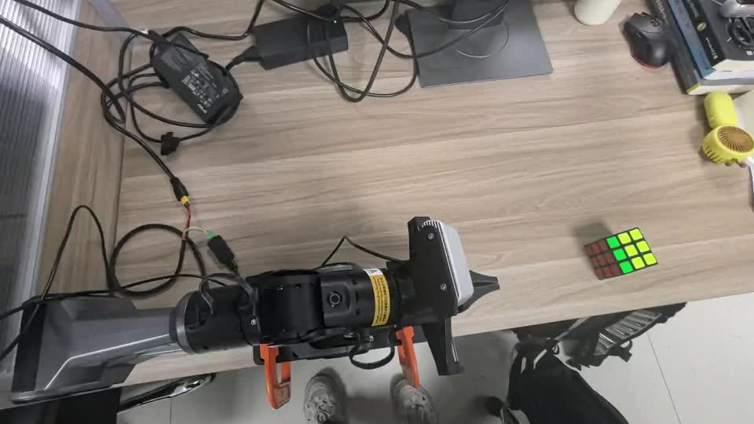
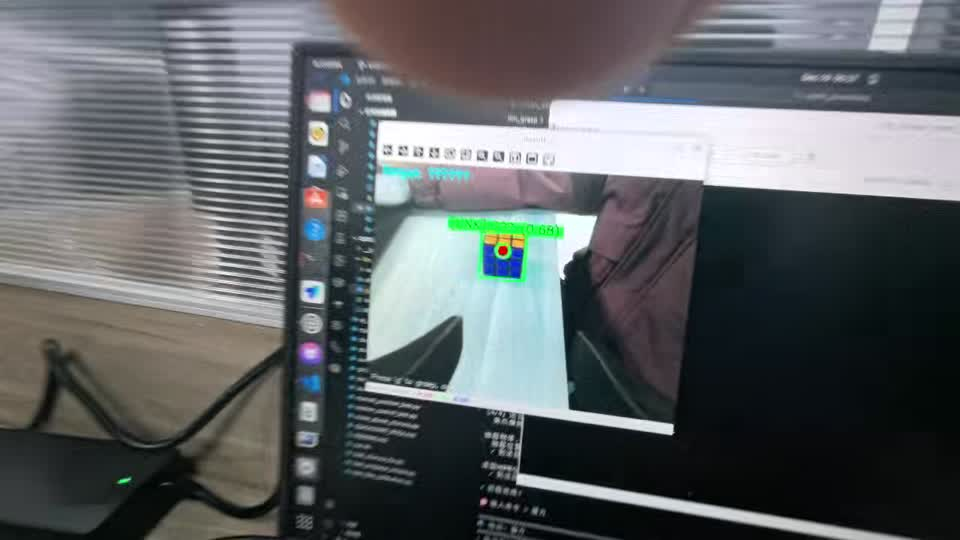
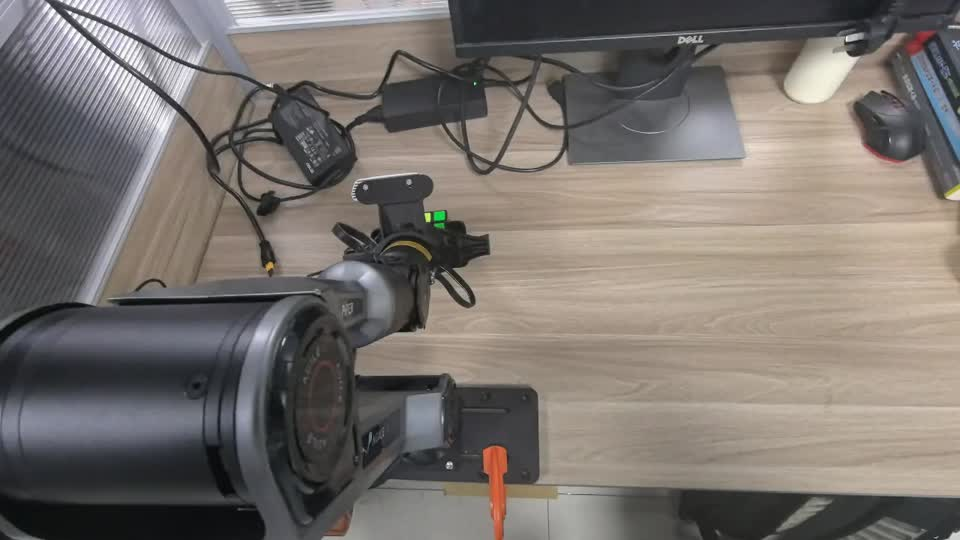
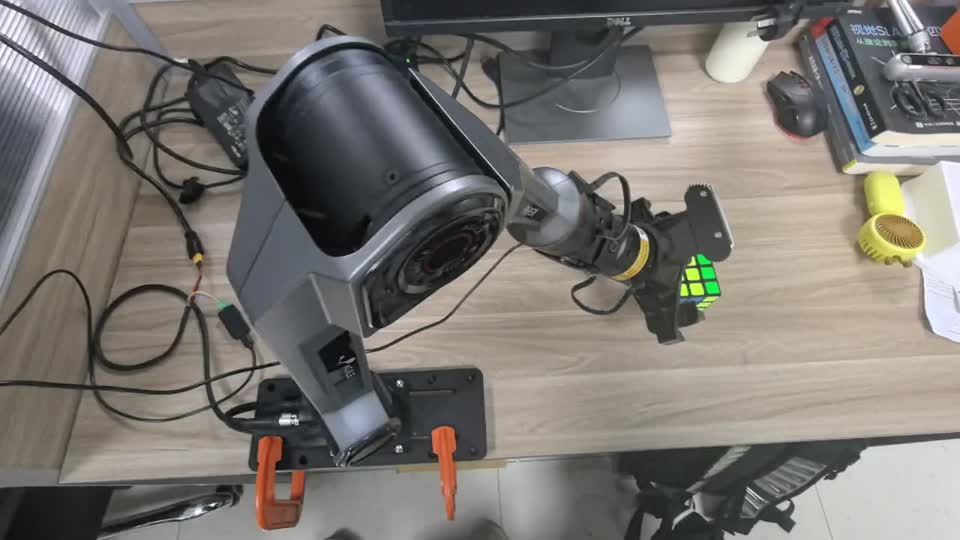
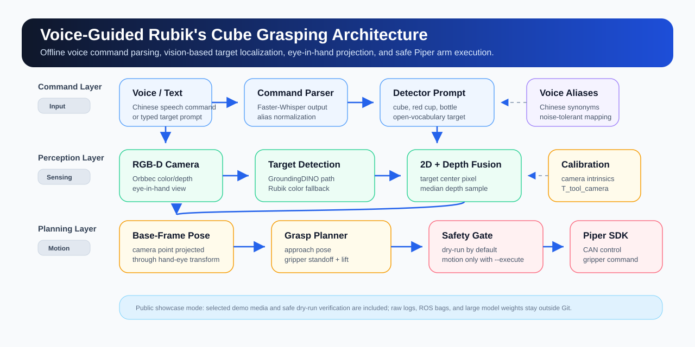

# Voice-Guided Robotic Arm for Rubik's Cube Grasping

Voice-guided grasping demo for a Piper robotic arm. The system maps spoken Chinese object commands to detector prompts, localizes a Rubik's Cube from RGB/depth camera input, projects the target through an eye-in-hand calibration, and sends a safe grasp plan to the Piper SDK.

This repository is a public showcase version of the project: it keeps the core code, configuration, demo media, and reproducible dry-run path, while excluding large model weights, runtime logs, ROS bags, and local machine paths.

## Demo

The full MP4 demo includes audio. It records the voice-guided workflow and the robotic arm grasping test. The GIF below is a silent preview because GIF files do not support audio.

- [Full demo video with audio](docs/media/rubik_grasp_demo_with_audio.mp4)
- Silent GIF preview:


Key frames from the same demo:

| Target scene | Detection interface |
| --- | --- |
|  |  |

| Gripper approach | Grasp close-up |
| --- | --- |
|  |  |

## What It Demonstrates

- Offline voice command handling with Faster-Whisper and a Chinese-to-English target alias map.
- Rubik's Cube command normalization, including noisy variants of the spoken word.
- Open-vocabulary vision path for GroundingDINO, with a lightweight Rubik color fallback for public dry-run tests.
- RGB/depth target localization using camera intrinsics.
- Eye-in-hand transformation from camera coordinates to Piper base-frame grasp planning.
- Piper SDK execution adapter with dry-run as the default mode and hardware motion enabled only by `--execute`.

## Architecture



## Repository Structure

```text
.
├── config/
│   ├── grasp_profile.yaml          # Camera, robot, detector, and grasp settings
│   ├── T_ee_cam_example.yaml       # Public placeholder hand-eye transform
│   └── voice_aliases_zh.yaml       # Spoken Chinese aliases mapped to detector prompts
├── docs/
│   ├── assets/                     # Selected demo screenshots
│   ├── media/                      # GIF preview and MP4 demo with audio
│   └── model_weights.md            # Weight and dependency policy
├── scripts/
│   └── download_weights.sh         # Optional model-weight helper
├── src/voice_rubik_grasping/
│   ├── app.py                      # CLI entry point
│   ├── perception.py               # Detector wrappers and visualization
│   ├── robot.py                    # Hand-eye projection and Piper adapter
│   └── voice.py                    # Voice recognition and command parsing
└── tests/
    ├── test_planner.py
    └── test_voice_parser.py
```

## Quick Start

Create an environment:

```bash
python3 -m venv .venv
source .venv/bin/activate
pip install -e .
```

Run the public dry-run demo on the included video. This detects the Rubik's Cube and prints the planned target pose without moving hardware:

```bash
voice-rubik-grasp \
  --video docs/media/rubik_grasp_demo_with_audio.mp4 \
  --frame-index 80 \
  --target cube \
  --output outputs/rubik_detection.jpg
```

Run with a typed command:

```bash
voice-rubik-grasp --video docs/media/rubik_grasp_demo_with_audio.mp4 --target "cube"
```

Run with one spoken command:

```bash
voice-rubik-grasp --camera-index 0 --voice
```

## Hardware Execution

Hardware motion is intentionally opt-in. Before using `--execute`, replace `config/T_ee_cam_example.yaml` with the calibrated tool-to-camera transform, confirm the camera intrinsics in `config/grasp_profile.yaml`, bring up the camera stream, and verify the robot workspace.

```bash
voice-rubik-grasp \
  --camera-index 0 \
  --voice \
  --depth-m 0.35 \
  --execute
```

The command above requires the Piper SDK, a configured CAN interface, a valid hand-eye calibration, and a clear emergency-stop procedure.

## Model Weights

Large model weights are not committed to this repository. The original local experiment used:

- `groundingdino_swint_ogc.pth`
- `efficient_sam_vits.pt`

Place optional weights under `weights/` if you want the GroundingDINO path. Without those weights, the public demo still supports the Rubik color fallback and dry-run planning.

See [docs/model_weights.md](docs/model_weights.md) for details.

## Verification

```bash
python3 -m compileall -q src tests
PYTEST_DISABLE_PLUGIN_AUTOLOAD=1 PYTHONPATH=src python3 -m pytest -q
PYTHONNOUSERSITE=1 PYTHONPATH=src python3 -m voice_rubik_grasping.app \
  --video docs/media/rubik_grasp_demo_with_audio.mp4 \
  --frame-index 80 \
  --target cube \
  --output outputs/rubik_detection.jpg
```

## Public Data Policy

This public repository includes selected demo media and public-safe source code. It excludes raw experiment folders, local logs, ROS bags, cache files, and large model weights. Hardware execution remains disabled unless `--execute` is explicitly passed.
